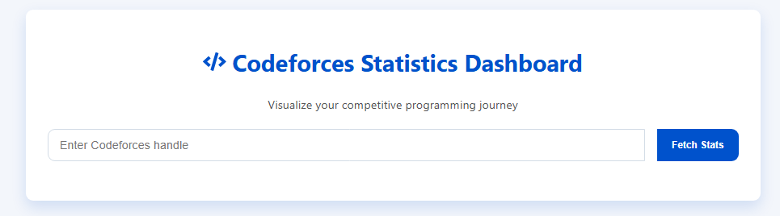
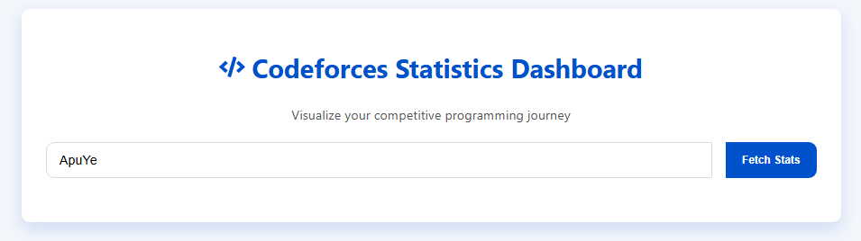
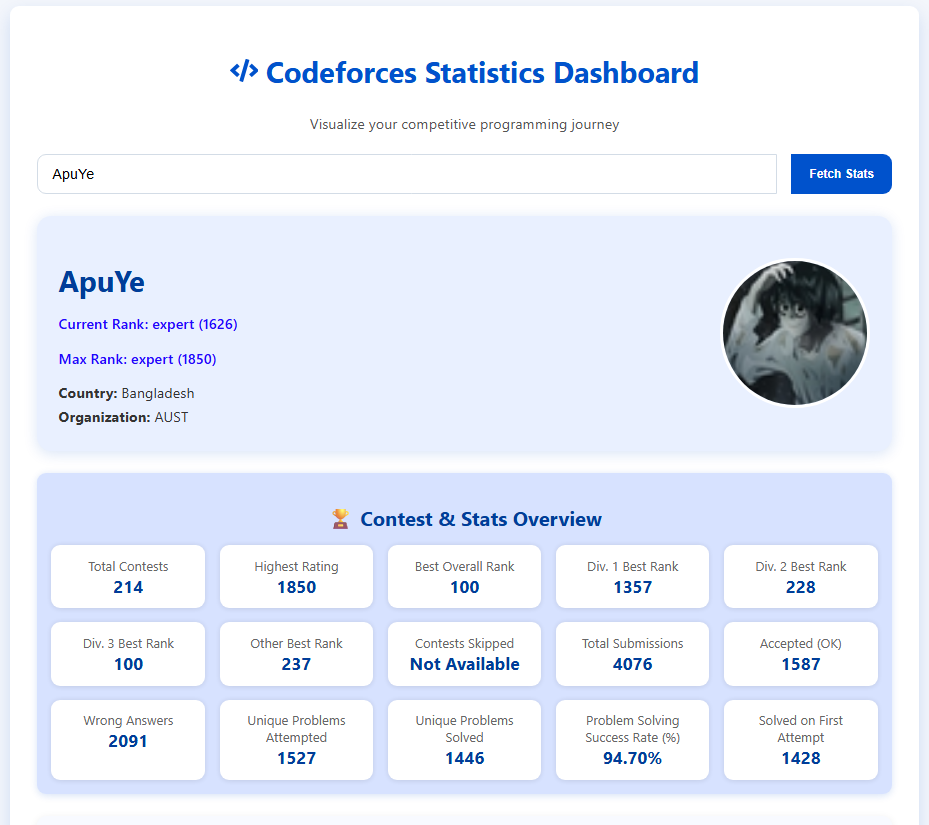
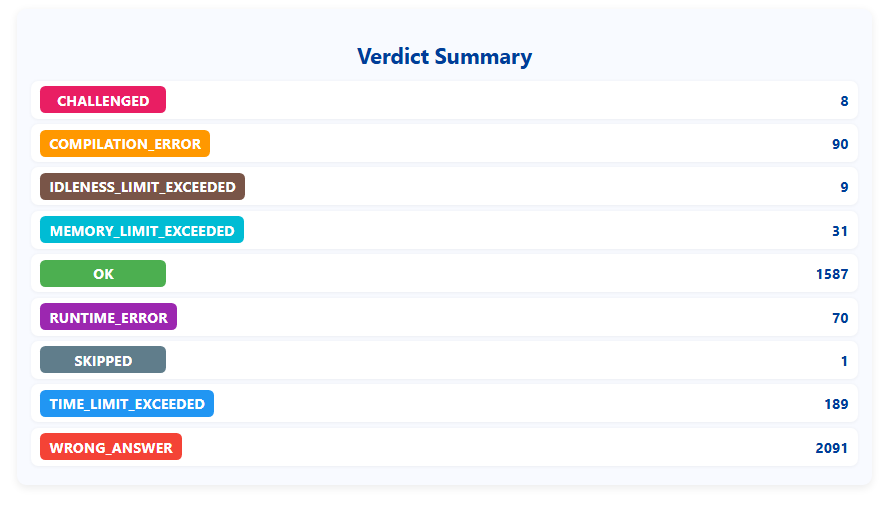
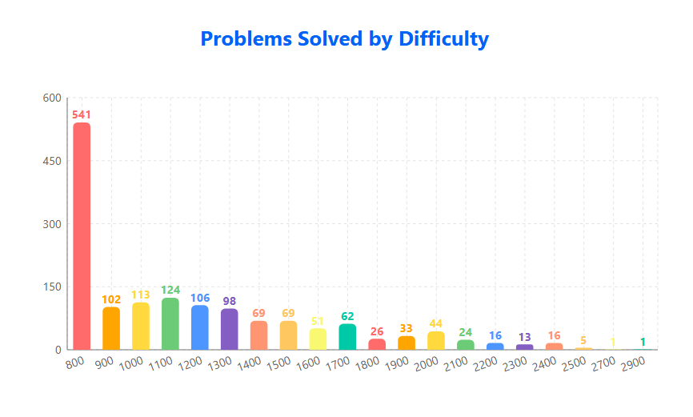
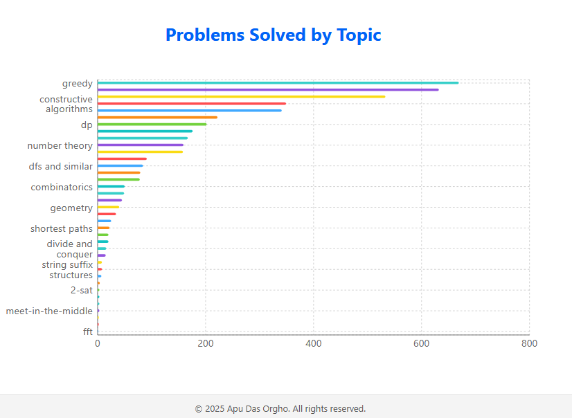

# 📊 Codeforces Stats Dashboard


🚀 **Codeforces Stats Dashboard** is a modern, responsive web application that fetches and visualizes user performance from Codeforces using interactive charts, summaries, and detailed statistics.  
Perfect for competitive programmers who want to **track their progress, contest history, and problem-solving trends**.

---

## ✨ Features

- 🔍 **Search any Codeforces handle** and fetch live statistics
- 📇 **Profile Overview**
  - Rank, rating, max rank, contribution, country, organization
- 📊 **Interactive Graphs**
  - Problems solved by difficulty
  - Problems solved by topic
- 🏆 **Contest Overview**
  - Total contests, best ranks, highest rating, divisions performance
- 📈 **Rank & Percentile Statistics**
  - World rank, country rank, and percentile distribution
- ✅ **Verdict Analysis**
  - OK, WA, TLE, MLE, RTE counts in a colorful summary
- 📱 **Responsive Design**
  - Works seamlessly on desktop and mobile devices

---

## 🖼️ Screenshots
> **Search Handle**
> 
> 
> **Profile & Overview**
> 

>**Verdict Summary**
> 

> **Graph: Problems solved by difficulty**
> 

> **Graph: Problems solved by topic**
> 

---

## 🛠️ Tech Stack

- **Frontend**: [React.js](https://react.dev/) (Hooks, Functional Components)
- **Styling**: CSS Modules / Custom Styling
- **Charts**: [Recharts](https://recharts.org/en-US/)
- **Icons**: [React Icons](https://react-icons.github.io/react-icons/)
- **API**: [Codeforces API](https://codeforces.com/apiHelp)

---

## ⚡ Installation & Setup

### 1️⃣ Clone the repository

```bash
git clone https://github.com/apuorgho/frontend-codeforces-stats-dashboard.git
cd codeforces-stats-dashboard
```
